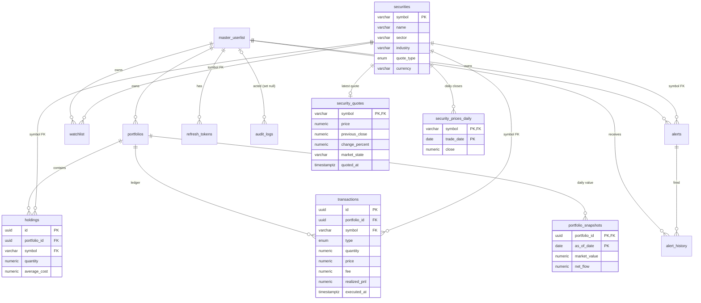

# Dashboard MVP — Backend Implementation Plan

Status: **implemented** (Phases 0–7) · Date: 2026-09-30 · Scope: backend only (`wealth-pulse-be`)

> Deviations from the proposal, as built:
> - Tests use `node:test` + `tsx` + Supertest — `ts-jest` doesn't support TypeScript 7.
> - `eod-prices` and `portfolio-snapshot` are one job (closes, then snapshots) instead of two chained queues.
> - `price-history-backfill` is folded into `snapshot-rebuild` (it fetches missing history before rebuilding) and `marketService.ensureHistory`.
> - Holdings are rebuilt by replaying the symbol's whole ledger on every insert/delete (`utils/ledger.ts`), so backdated trades and deletes recompute average cost and every sell's `realized_pnl` correctly.
> - Intraday (1D/1W) series keep regular-hours bars only; Yahoo returns pre/post-market for stocks but not indices.
> - Seed data for the admin user: `npm run db:seed`.

This plan covers the backend for the Wealth Pulse Dashboard MFE. That includes the new tables and their relations, the jobs that feed them, the endpoints and their response shapes, and the order to build everything in.

---

## 0. What the dashboard needs and where each piece comes from

| # | Widget | Data source | Stored in | Endpoint |
|---|---|---|---|---|
| 1 | Portfolio summary | holdings + transactions + latest quotes + yesterday's snapshot | Postgres | `GET /api/dashboard/summary` |
| 2 | Performance chart (1D–1Y) | 1D/1W: Yahoo intraday bars × current qty · 1M–1Y: `portfolio_snapshots` | Redis (intraday), Postgres (daily) | `GET /api/dashboard/performance` |
| 3 | Real-time holdings | holdings + `securities` + `security_quotes` | Postgres | `GET /api/dashboard/holdings` + socket `stock:price:updated` |
| 4 | Allocation (stock / sector) | derived from holdings rows (`weightPct`, `sector`) | — | none, the MFE groups `holdings` |
| 5 | Market overview + market-open badge | `security_quotes` for benchmark symbols | Postgres | `GET /api/market/indices` |
| 6 | Portfolio vs market | same series as #2 plus benchmark series | Postgres / Redis | `GET /api/dashboard/performance?benchmarks=` |
| 7–8 | Top gainers / losers | Yahoo screener `day_gainers` / `day_losers` | Redis | `GET /api/market/movers?type=` |
| 9 | Your biggest movers | holdings rows sorted by `abs(todayPnl)` | — | none, the MFE sorts `holdings` |
| 10 | Trending / market news | Yahoo `search` news | Redis | `GET /api/news` |
| 11 | Holding news | Yahoo `search` news per held symbol | Redis | `GET /api/news/holdings` |
| 12 | Cash / account summary | **not supported.** The schema has no cash ledger. | — | deferred (see §9) |

Widgets 4 and 9 are sorts and group-bys over data the MFE already has from `/holdings`, so they don't get endpoints. If the MFE ever needs them without loading holdings, add an endpoint then.

The dashboard gets one endpoint per widget, not a single mega endpoint. That lets each widget load and fail on its own (a Yahoo outage breaks news, not your portfolio value) and have its own cache TTL.

---

## 1. Data model

### 1.1 New tables

| Table | Purpose | Key | Written by |
|---|---|---|---|
| `securities` | Symbol master: company name, sector, exchange, type. Every symbol-bearing table references it. | `symbol` (natural PK) | trade/watchlist/alert services (upsert on first use) and the `security-profile` job |
| `security_quotes` | Latest quote per symbol: price, previous close, change, market state | `symbol` (PK + FK) | `price-update` job |
| `security_prices_daily` | Daily close per symbol per trading day. Used for snapshots and benchmark lines. | `(symbol, trade_date)` | `price-history` jobs |
| `portfolio_snapshots` | End-of-day portfolio value and that day's net cash flow | `(portfolio_id, as_of_date)` | `portfolio-snapshot` jobs |

### 1.2 Changes to existing tables

| Table | Change | Why |
|---|---|---|
| `transactions` | add `realized_pnl numeric(20,6) NULL`, set on sells only | Overall P&L needs realized gains. Replaying average cost at read time is expensive and error-prone. |
| `holdings`, `transactions`, `watchlist`, `alerts` | `symbol` becomes an FK → `securities.symbol` (`ON DELETE RESTRICT`) | Gives company name and sector with a join, and guarantees every held symbol has quotes and history |
| `alert_history` | no FK | It stores a historical copy and should outlive anything |

**Deliberate exception to `.claude/rules/database.md`:** the `securities` family uses `symbol` as its natural primary key instead of a `uuid`. Every existing table already stores `symbol`, so a surrogate key would force a join rewrite for nothing. Update the rule to say so.

### 1.3 Drizzle schema (additions to `src/db/schema.ts`)

```ts
import { bigint, date, primaryKey /* + existing imports */ } from 'drizzle-orm/pg-core';

export const quoteType = pgEnum('quote_type', ['EQUITY', 'ETF', 'INDEX', 'MUTUALFUND', 'CRYPTOCURRENCY', 'OTHER']);

export const securities = pgTable('securities', {
  symbol: varchar('symbol', { length: 15 }).primaryKey(),
  name: varchar('name', { length: 255 }),             // null until the profile job runs
  exchange: varchar('exchange', { length: 50 }),
  currency: varchar('currency', { length: 3 }),
  quoteType: quoteType('quote_type').notNull().default('EQUITY'),
  sector: varchar('sector', { length: 100 }),         // null for ETFs/indices → "Other"/"ETF" in allocation
  industry: varchar('industry', { length: 100 }),
  profileUpdatedAt: timestamp('profile_updated_at', { withTimezone: true }),
  ...timestamps,
});

export const securityQuotes = pgTable('security_quotes', {
  symbol: varchar('symbol', { length: 15 })
    .primaryKey()
    .references(() => securities.symbol, { onDelete: 'cascade' }),
  price: money('price').notNull(),
  previousClose: money('previous_close').notNull(),
  change: money('change').notNull(),
  changePercent: money('change_percent').notNull(),
  dayHigh: money('day_high'),
  dayLow: money('day_low'),
  volume: bigint('volume', { mode: 'number' }),
  marketState: varchar('market_state', { length: 20 }).notNull(), // REGULAR | PRE | POST | CLOSED …
  quotedAt: timestamp('quoted_at', { withTimezone: true }).notNull(), // Yahoo regularMarketTime
  ...timestamps,
});

export const securityPricesDaily = pgTable(
  'security_prices_daily',
  {
    symbol: varchar('symbol', { length: 15 })
      .notNull()
      .references(() => securities.symbol, { onDelete: 'cascade' }),
    tradeDate: date('trade_date', { mode: 'string' }).notNull(), // exchange-local (America/New_York) date
    close: money('close').notNull(),
    ...timestamps,
  },
  (t) => [primaryKey({ columns: [t.symbol, t.tradeDate] })],
);

export const portfolioSnapshots = pgTable(
  'portfolio_snapshots',
  {
    portfolioId: uuid('portfolio_id')
      .notNull()
      .references(() => portfolios.id, { onDelete: 'cascade' }),
    asOfDate: date('as_of_date', { mode: 'string' }).notNull(),
    marketValue: money('market_value').notNull(), // Σ position qty × close on that date
    netFlow: money('net_flow').notNull().default('0'), // buys (qty×price+fee) − sells (qty×price−fee) that day
    ...timestamps,
  },
  (t) => [primaryKey({ columns: [t.portfolioId, t.asOfDate] })],
);
```

Symbol FK on existing tables: replace the shared `symbol` column constant with a factory. A single builder instance can't carry a per-table `references`.

```ts
const symbolRef = () =>
  varchar('symbol', { length: 15 }).notNull().references(() => securities.symbol, { onDelete: 'restrict' });
// holdings/transactions/watchlist/alerts: symbol: symbolRef(),
// alert_history keeps a plain varchar (no FK).

// transactions: add
realizedPnl: money('realized_pnl'), // sells only; null on buys
```

Every PK above leads with the column queries filter on, so no extra indexes are needed:
- snapshot range reads go through `(portfolio_id, as_of_date)`
- price lookups go through `(symbol, trade_date)`

### 1.4 Relations

```ts
export const securitiesRelations = relations(securities, ({ one, many }) => ({
  quote: one(securityQuotes, { fields: [securities.symbol], references: [securityQuotes.symbol] }),
  dailyPrices: many(securityPricesDaily),
  holdings: many(holdings),
  transactions: many(transactions),
  watchlistItems: many(watchlist),
  alerts: many(alerts),
}));
export const securityQuotesRelations = relations(securityQuotes, ({ one }) => ({
  security: one(securities, { fields: [securityQuotes.symbol], references: [securities.symbol] }),
}));
export const securityPricesDailyRelations = relations(securityPricesDaily, ({ one }) => ({
  security: one(securities, { fields: [securityPricesDaily.symbol], references: [securities.symbol] }),
}));
export const portfolioSnapshotsRelations = relations(portfolioSnapshots, ({ one }) => ({
  portfolio: one(portfolios, { fields: [portfolioSnapshots.portfolioId], references: [portfolios.id] }),
}));
// existing: add `security: one(securities, …)` to holdings/transactions/watchlist/alerts relations,
// and `snapshots: many(portfolioSnapshots)` to portfoliosRelations.
```

### 1.5 ER diagram



Ownership paths (IDOR rule):
- `holdings`, `transactions` and `portfolio_snapshots` reach the user through `portfolios.user_id`. Every query joins `portfolios` and filters `portfolios.user_id = :userId`.
- `securities`, `security_quotes` and `security_prices_daily` are global market data, not user-owned.

### 1.6 Migration (`/db-migration`)

1. Edit `schema.ts` as above, then run `npx drizzle-kit generate --name dashboard_market_data`.
2. **Hand-edit the generated SQL before applying it.** It hasn't been applied yet, so editing is allowed. Between `CREATE TABLE securities` and the `ADD CONSTRAINT … FOREIGN KEY` statements, insert:
   ```sql
   INSERT INTO securities (symbol)
   SELECT symbol FROM holdings UNION SELECT symbol FROM transactions
   UNION SELECT symbol FROM watchlist UNION SELECT symbol FROM alerts
   ON CONFLICT DO NOTHING;
   --> statement-breakpoint
   INSERT INTO securities (symbol, name, quote_type, currency) VALUES
     ('^GSPC','S&P 500','INDEX','USD'), ('^IXIC','NASDAQ Composite','INDEX','USD'),
     ('^DJI','Dow Jones Industrial Average','INDEX','USD'), ('^VIX','CBOE Volatility Index','INDEX','USD')
   ON CONFLICT DO NOTHING;
   ```
   Without this, the FK constraints fail on existing rows.
3. Run `npx drizzle-kit migrate`.
4. Run `security-profile` and `price-history-backfill` once for every row in `securities` (a boot-time or one-off script enqueues them).

---

## 2. Money and return definitions

These are the single source of truth, and every endpoint uses them. All arithmetic is Postgres `numeric` in SQL, or `decimal.js` in TS where SQL doesn't fit (intraday series, TWR chaining). Responses carry decimal **strings**: money rounded to 2 dp, percentages to 2 dp, prices as stored.

| Field | Definition |
|---|---|
| `marketValue` | Σ qty × `security_quotes.price` over open holdings. This is also the "Total portfolio value" until cash exists (`totalValue = marketValue + cash` later). |
| `invested` | Cost basis of open positions: Σ qty × `average_cost`. Buy fees are **included** in average cost. |
| `totalReturn` / `totalReturnPct` | `marketValue − invested` / `÷ invested`. This is the unrealized gain and matches the mockup: 284,521 − 251,200 = 33,321 (13.26%). |
| `realizedPnl` | Σ `transactions.realized_pnl`, where for a sell it is `qty × (price − average_cost_at_sale) − fee`, written in the same DB transaction as the sell |
| `overallPnl` | `totalReturn + realizedPnl` |
| `todayPnl` (portfolio) | `marketValue − V_prev − F_today`, where `V_prev` is the latest `portfolio_snapshots.market_value` before the current session date and `F_today` is the net flow of transactions in the current session. This is correct for positions bought, partly sold or fully sold today. |
| `todayPnlPct` | `todayPnl ÷ (V_prev + F_today)` |
| `todayPnl` (holding row) | `qty_now × price − qty_before_session × previous_close − netFlow_session(symbol)` |
| Session date | The America/New_York date of `security_quotes.quoted_at` for `^GSPC`. This handles weekends and holidays with no calendar table: on Saturday "today" is Friday's session. |
| Period return (chart) | Time-weighted: daily `r_d = (V_d − V_{d−1} − F_d) ÷ (V_{d−1} + F_d)`, chained `Π(1 + r_d) − 1`. This means buying more stock doesn't show up as "performance". Benchmarks use `close_d ÷ close_start − 1`. |

**Invariant the plan depends on:** holdings are always the running result of transactions. Every change to a holding goes through a transaction write in the same DB transaction (§3, Phase 2). Snapshots rebuild history from `transactions`, so a holding edited without a transaction row would make the history chart wrong.

---

## 3. Build phases

Each phase can ship on its own and ends green on `npm run type-check`, `npm run lint` and `npm test`.

### Phase 0 — Dependencies and plumbing

**New dependencies (need approval per CLAUDE.md):**

| Package | Why |
|---|---|
| `yahoo-finance2` | quotes, charts, profile, screener, news. No API key. |
| `bull` | scheduled and on-demand jobs (the CLAUDE.md stack) |
| `decimal.js` | exact math for intraday series and TWR chaining outside SQL |
| `socket.io`, `@socket.io/redis-adapter` | real-time holdings (Phase 6) |
| dev: `jest`, `ts-jest`, `supertest`, `@types/jest`, `@types/supertest` | the test harness in CLAUDE.md isn't installed yet |

**New files:**
- `src/config/yahoo.ts`: the single configured Yahoo client, with notices suppressed and a request timeout. Check the installed major version's API first: v3 uses `new YahooFinance()` and v2 uses a default instance.
- `src/config/cache.ts`: the `cacheService` (`get/set/delete/invalidatePattern` with SCAN+DEL) that `caching.md` describes. It doesn't exist yet. Cache errors are logged and ignored.
- `src/utils/marketTime.ts`: pure helpers built on `Intl.DateTimeFormat` with `timeZone: 'America/New_York'`: `toNyDate(date)`, `isRegularHours(now)`. No timezone library.
- `src/utils/constants.ts`: `BENCHMARKS = [{ symbol: '^GSPC', label: 'S&P 500' }, { '^IXIC', 'NASDAQ' }, { '^DJI', 'Dow Jones' }, { '^VIX', 'VIX' }]` and `PERFORMANCE_RANGES = ['1D','1W','1M','3M','6M','1Y']`.

### Phase 1 — Schema and migration

Follow §1.3–§1.6. Update `.claude/rules/database.md` (new tables, the natural-key exception) and `caching.md` (new keys, §5).

### Phase 2 — Trade write path (prerequisite; only `auth` exists today)

The dashboard is empty without it. Minimum scope:

| Endpoint | Notes |
|---|---|
| `POST/GET/PUT/DELETE /api/portfolios[/:id]` | standard CRUD, owner-filtered |
| `POST /api/portfolios/:id/transactions` | `{ type, symbol, quantity, price, fee?, executedAt? }`. The **only** way holdings change. |
| `GET /api/portfolios/:id/transactions` | paginated ledger |
| `DELETE /api/portfolios/:id/transactions/:txId` | recompute the holding from the remaining ledger |

`transactionsService.create` runs in one `db.transaction`:
1. Assert the portfolio is owned by the user (404 otherwise).
2. `ensureSecurity(symbol)`: if the symbol isn't in `securities`, validate it with one Yahoo `quote` call. Unknown symbol → 400. Non-USD → 400 (MVP limit). Insert the row, then enqueue `security-profile` and `price-history-backfill` **after commit**.
3. Buy: `newAvg = (qty×avg + q×price + fee) ÷ (qty + q)`, upsert the holding.
   Sell: reject if `q > qty` (400), write `realized_pnl = q×(price − avg) − fee`, decrease qty, and delete the holding at 0.
4. Insert the transaction row and an `audit_logs` row.
5. After commit: invalidate `dashboard:{userId}:*`. If `executedAt` is before the current session date, enqueue `snapshot-rebuild { portfolioId, fromDate }`.

### Phase 3 — Market data jobs (`src/jobs/`)

| Queue | Trigger | What it does |
|---|---|---|
| `price-update` | repeat every 30s with stable `jobId`. It skips unless it's regular hours or 5 min have passed since the last run. | Symbols = `DISTINCT` over holdings ∪ watchlist ∪ active alerts ∪ `BENCHMARKS`. Batch `quote()` in chunks of 100. Upsert `security_quotes` (`onConflictDoUpdate`), set `stock:{SYM}`, emit `stock:price:updated` (Phase 6). |
| `security-profile` | on demand (new symbol) + weekly repeat | `quoteSummary(symbol, { modules: ['price', 'assetProfile'] })` → name, exchange, currency, quoteType, sector, industry. ETFs and indices have no sector, which is fine. |
| `price-history-backfill` | on demand (new symbol, migration) | `chart(symbol, { period1: min(earliest tx for symbol, today − 1Y), interval: '1d' })` → upsert `security_prices_daily`. Then enqueue `snapshot-rebuild` for portfolios holding that symbol. |
| `eod-prices` | cron `30 16 * * 1-5`, tz `America/New_York` | `chart(range: '5d', interval: '1d')` for all tracked symbols → upsert. The 5-day window self-heals missed runs. On completion it enqueues `portfolio-snapshot`. |
| `portfolio-snapshot` | after `eod-prices` | If `^GSPC` has no bar for today (holiday), skip. Otherwise run the snapshot SQL for today for every portfolio with transactions, then `invalidatePattern('dashboard:*:perf:*')`. |
| `snapshot-rebuild` | on demand `{ portfolioId, fromDate }`, `jobId: rebuild:{portfolioId}` to dedupe | Same SQL over `fromDate..today`. Idempotent (upsert). |

All jobs follow `realtime.md`: `removeOnComplete: 1000`, `removeOnFail: 5000`, `attempts: 3` with exponential backoff for Yahoo calls, and idempotent processors.

**Snapshot SQL (sketch, one statement per portfolio and date range).** The trading calendar comes from `^GSPC` bars:

```sql
INSERT INTO portfolio_snapshots (portfolio_id, as_of_date, market_value, net_flow)
SELECT $1, d.trade_date,
       COALESCE(SUM(pos.qty * px.close), 0),
       COALESCE(MAX(fl.net_flow), 0)
FROM security_prices_daily d
LEFT JOIN LATERAL (
  SELECT t.symbol, SUM(CASE WHEN t.type = 'buy' THEN t.quantity ELSE -t.quantity END) AS qty
  FROM transactions t
  WHERE t.portfolio_id = $1 AND (t.executed_at AT TIME ZONE 'America/New_York')::date <= d.trade_date
  GROUP BY t.symbol
  HAVING SUM(CASE WHEN t.type = 'buy' THEN t.quantity ELSE -t.quantity END) > 0
) pos ON true
LEFT JOIN LATERAL (
  SELECT p.close FROM security_prices_daily p
  WHERE p.symbol = pos.symbol AND p.trade_date <= d.trade_date
  ORDER BY p.trade_date DESC LIMIT 1
) px ON true
LEFT JOIN LATERAL (
  SELECT SUM(CASE WHEN t.type = 'buy' THEN t.quantity * t.price + t.fee
                  ELSE -(t.quantity * t.price - t.fee) END) AS net_flow
  FROM transactions t
  WHERE t.portfolio_id = $1 AND (t.executed_at AT TIME ZONE 'America/New_York')::date = d.trade_date
) fl ON true
WHERE d.symbol = '^GSPC' AND d.trade_date BETWEEN $2 AND $3
  AND d.trade_date >= (SELECT MIN(executed_at AT TIME ZONE 'America/New_York')::date
                       FROM transactions WHERE portfolio_id = $1)
GROUP BY d.trade_date
ON CONFLICT (portfolio_id, as_of_date)
DO UPDATE SET market_value = EXCLUDED.market_value, net_flow = EXCLUDED.net_flow, updated_at = now();
```

Keep this as raw `sql` in `snapshotsRepository` (in `routes/dashboard/dashboardRepository.ts`). Drizzle's query builder doesn't make it clearer.

### Phase 4 — Dashboard endpoints (`src/routes/dashboard/`)

Feature folder: `dashboardRoutes`, `dashboardController`, `dashboardService`, `dashboardRepository`, mounted at `/api/dashboard`. All endpoints require `authenticate`.

Common query parameter: `portfolioId?: uuid`. If it's omitted, all the user's portfolios are aggregated. If it's given but not owned, return 404.

#### `GET /api/dashboard/summary`

```json
{
  "data": {
    "asOf": "2026-09-30T19:59:30.000Z",
    "marketState": "REGULAR",
    "currency": "USD",
    "marketValue": "284521.32",
    "invested": "251200.00",
    "todayPnl": "4281.42",
    "todayPnlPct": "1.53",
    "totalReturn": "33321.32",
    "totalReturnPct": "13.26",
    "realizedPnl": "1820.00",
    "overallPnl": "35141.32",
    "holdingsCount": 12
  }
}
```

The repository makes three owner-filtered queries: open holdings × quotes aggregate, `V_prev` from snapshots, and session flows plus Σ realized. If there's no previous snapshot yet (new user), `todayPnl` falls back to Σ of the holding rows' `todayPnl`.

#### `GET /api/dashboard/holdings`

Query: `portfolioId?`, `sort=marketValue|todayPnl|totalPnl|symbol` (default `marketValue`), `order=asc|desc`.

```json
{
  "data": [{
    "symbol": "AAPL", "name": "Apple Inc.", "sector": "Technology", "quoteType": "EQUITY",
    "quantity": "120", "averageCost": "180.00", "costBasis": "21600.00",
    "price": "227.45", "previousClose": "223.94",
    "todayChange": "3.51", "todayChangePct": "1.57", "todayPnl": "421.20",
    "marketValue": "27294.00", "totalPnl": "5694.00", "totalReturnPct": "26.36",
    "weightPct": "9.59", "quoteAsOf": "2026-09-30T19:59:30.000Z"
  }]
}
```

With no `portfolioId`, rows are merged across portfolios by symbol: `qty = Σ`, `averageCost = Σ costBasis ÷ Σ qty`. The whole row is computed in one SQL query (open holdings ⨝ `securities` ⨝ `security_quotes`, left-joined with session transactions per symbol). The MFE derives **Allocation** (group `weightPct` by `symbol` or `sector`, top 5 + "Others") and **Your biggest movers** (sort by `|todayPnl|`, take 5) from this response.

#### `GET /api/dashboard/performance`

Query: `range=1D|1W|1M|3M|6M|1Y` (required), `benchmarks=^GSPC,^IXIC` (optional, max 3, must be in `BENCHMARKS`), `portfolioId?`.

| Range | Interval | Portfolio series | Benchmark series |
|---|---|---|---|
| 1D | 5m | Yahoo `chart(range:'1d', interval:'5m')` per held symbol, Σ current qty × bar close (decimal.js) | same call for benchmark |
| 1W | 1h | same with `range:'5d', interval:'1h'` | same |
| 1M–1Y | 1d | `portfolio_snapshots` Σ across owned portfolios by date, TWR chained in the service, plus today's live point from `/summary` math | `security_prices_daily` |

```json
{
  "data": {
    "range": "1M", "interval": "1d",
    "portfolio": {
      "returnPct": "13.26",
      "points": [{ "t": "2026-09-01", "value": "271020.11", "returnPct": "0.00" }]
    },
    "benchmarks": [{
      "symbol": "^GSPC", "label": "S&P 500", "returnPct": "10.82",
      "points": [{ "t": "2026-09-01", "returnPct": "0.00" }]
    }]
  }
}
```

The baseline is the last point on or before the range start. The first point is always `returnPct: "0.00"`.

**Known limit:** 1D/1W use current quantities, so intraday trades made today are ignored in those two ranges. Fix later by applying the session's transactions to bars after their `executedAt`.

### Phase 5 — Market and news endpoints

`src/routes/market/`, mounted at `/api/market` (auth required: the data is public, but it keeps the API closed and rate-limitable).

| Endpoint | Source | Response `data` |
|---|---|---|
| `GET /indices` | `security_quotes ⨝ securities` for `BENCHMARKS` (DB, kept fresh by `price-update`) | `{ marketState, asOf, indices: [{ symbol, label, price, change, changePercent }] }`. `marketState` drives the "Market Open 🟢" badge. |
| `GET /movers?type=gainers\|losers&limit=10` | Yahoo `screener({ scrIds: 'day_gainers' \| 'day_losers', count })` | `[{ symbol, name, price, changePercent }]` |

`marketService` also owns the Yahoo call wrappers (`quoteBatch`, `chart`, `profile`, `screener`, `searchNews`). They map failures to 502 `UPSTREAM_ERROR` and handle caching. The dashboard, news and jobs services import them from here.

`src/routes/news/`, mounted at `/api/news`:

| Endpoint | Source | Notes |
|---|---|---|
| `GET /?limit=20` | Yahoo `search('stock market', { newsCount, quotesCount: 0 })` | MVP category is "trending". Later categories (Markets, Economy, Technology) become a `category` → query map in `constants.ts`. |
| `GET /holdings?limit=20` | Top 10 user holdings by market value → `searchNews(symbol)` each, run with `Promise.allSettled` | Merge, dedupe by `uuid`, sort by `publishedAt` desc. Tag each item with the held symbols it mentions (`relatedTickers ∩ holdings`). One failing symbol doesn't fail the response. |

News item shape: `{ id, title, publisher, url, publishedAt, thumbnailUrl?, symbols: [] }`. Only pass through `http(s)` URLs.

No news table in the MVP: Redis is enough. Add `news_articles` + `news_article_symbols` (M:N) only when read state, bookmarks or history are needed.

### Phase 6 — Real-time holdings (`src/websocket/`)

- Socket.io with `@socket.io/redis-adapter`. The handshake verifies the access-token cookie and rejects before `connection` (`security.md`).
- Events in `websocket/events.ts`: client sends `subscribe:stock` / `unsubscribe:stock` (Zod-validated symbol, max 50 rooms per socket), server sends `stock:price:updated { symbol, price, change, changePercent, previousClose, marketState, timestamp }`.
- The `price-update` job emits to `stock:{SYM}` after upserting quotes.
- MFE behaviour: subscribe to held symbols and benchmarks. Patch holding rows and index tiles in place, recomputing row P&L from the quantity and cost it already has (display only). Refetch `/summary`, debounced at ≥15s.
- No per-user server push of the summary in the MVP. Add `portfolio:updated` (already specified in `realtime.md`) only if refetching proves too chatty.

### Phase 7 — Tests (`test-writer` agent)

| Test | Kind |
|---|---|
| Buy/sell average cost, `realized_pnl`, oversell → 400, sell-to-zero deletes the holding | unit + integration |
| `todayPnl` with a buy today, a partial sell today and a full sell today | integration (seeded DB, fixed quotes) |
| TWR chaining: a deposit mid-range doesn't count as return | unit |
| Snapshot SQL: backdated transaction → rebuild produces the expected values | integration against the test DB |
| IDOR: `portfolioId` of another user → 404 on every dashboard endpoint | integration |
| Yahoo down → market/news endpoints 502, summary/holdings still 200 with stale `quoteAsOf` | integration, Yahoo client mocked via `jest.mock('@/config/yahoo')` |

---

## 4. Endpoint summary

| Method | Path | Auth | Cache |
|---|---|---|---|
| GET | `/api/dashboard/summary` | ✓ | `dashboard:{userId}:{scope}:summary` 30s |
| GET | `/api/dashboard/holdings` | ✓ | `dashboard:{userId}:{scope}:holdings` 30s |
| GET | `/api/dashboard/performance` | ✓ | `dashboard:{userId}:{scope}:perf:{range}`: 1D 60s, 1W 300s, 1M+ 3600s |
| GET | `/api/market/indices` | ✓ | `market:indices` 30s |
| GET | `/api/market/movers` | ✓ | `market:movers:{type}` 300s |
| GET | `/api/news` | ✓ | `news:trending` 900s |
| GET | `/api/news/holdings` | ✓ | `news:symbol:{SYM}` 900s (per symbol, shared across users) |
| POST/GET/PUT/DELETE | `/api/portfolios…`, `/api/portfolios/:id/transactions…` | ✓ | invalidate `dashboard:{userId}:*`, `portfolio:{userId}` |

`{scope}` is `all` or the `portfolioId`.

## 5. Cache key changes (`caching.md`)

| Key | TTL | Invalidated by |
|---|---|---|
| `dashboard:{userId}:{scope}:*` | see §4 | any portfolio or transaction mutation by that user (`invalidatePattern`) |
| `dashboard:*:perf:*` | see §4 | `portfolio-snapshot` / `snapshot-rebuild` jobs |
| `market:indices` | **30s** (was 900s, too stale next to live holdings) | TTL |
| `market:movers:{type}` | 300s | TTL |
| `news:trending`, `news:symbol:{SYM}` | 900s | TTL |
| `stock:{SYM}:chart:{range}` | 1D 60s, 1W 300s | TTL |

## 6. File map

```
src/config/yahoo.ts                  new
src/config/cache.ts                  new (cacheService)
src/utils/marketTime.ts              new
src/utils/constants.ts               new
src/db/schema.ts                     edit (§1.3–1.4)
src/db/migrations/0002_*.sql         generated + hand-edited backfill
src/routes/portfolios/*              new (Phase 2: portfolios + transactions)
src/routes/dashboard/*               new
src/routes/market/*                  new (also Yahoo wrappers)
src/routes/news/*                    new
src/routes/index.ts                  edit (mount /portfolios, /dashboard, /market, /news)
src/jobs/{queues,priceUpdate,securityProfile,priceHistory,portfolioSnapshot}.ts  new
src/websocket/{server,events,handlers}.ts  new (Phase 6)
.claude/rules/{database,caching,api}.md    edit
```

## 7. Order and dependencies

```
Phase 0 ─► Phase 1 ─► Phase 2 ─► Phase 3 ─► Phase 4 ─► Phase 6
                                    └──────► Phase 5
Phase 7 runs alongside each phase.
```

The first useful demo comes after Phases 0–2, 3 (`price-update` only) and 4 (`summary` + `holdings`). Performance charts need the rest of Phase 3.

## 8. Known ceilings (deliberate MVP cuts)

- **USD only.** Non-USD symbols are rejected at trade time. Multi-currency needs FX rates and a base-currency setting.
- **No splits or dividends.** `transaction_type` is `buy|sell`. A split will break history until a `split` type exists (and a `dividend` type for income).
- **Intraday 1D/1W ignore same-day trades** (§Phase 4).
- **Yahoo is an unofficial API.** It's rate-limited and may break. Every call goes through `marketService`, so swapping the provider touches one file.
- **Snapshot rebuild is per portfolio and sequential.** That's fine to thousands of portfolios. Batch by date across portfolios if the EOD job gets slow.

## 9. Open questions

1. **Cash.** Widget 12 needs a cash ledger (`cash_transactions`: deposit/withdraw/dividend/fee, plus buys and sells debiting cash). Is that in the MVP or later? Until then the widget stays hidden, with no fake numbers.
2. **Default scope.** Should the dashboard aggregate all portfolios (as planned), or default to one selected portfolio?
3. **Pre/post-market prices.** Show them in holdings, or regular-session prices only (as planned)?
4. **MFE origin.** If the Dashboard MFE is served from a different origin than `FRONTEND_URL`, CORS and the cookie `sameSite` settings need revisiting.
